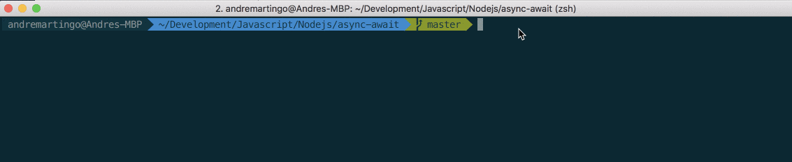

<p align="center">
  
</p>

# Node.js Exchange Terminal App
Node script to calculate Exchange Currency based on Currency Code.
It fetches the currency rate and get the countries which use it.

## Goals
* Async/Await
* Terminal
* Yargs

## Instalation
```bash
$ git clone git@github.com:andremartingo/node-async-await-kata.git
$ cd node-async-await-kata
$ npm install
```
## Usage
```bash
$ node currency-converter.js -i "USD" -f "EUR" -a 3
```
## Demo

